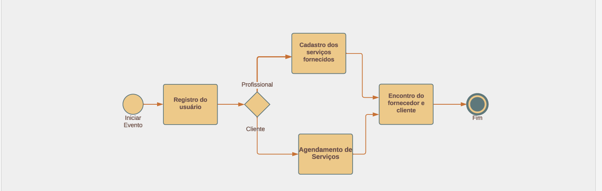
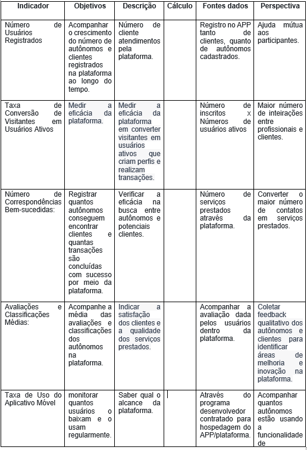
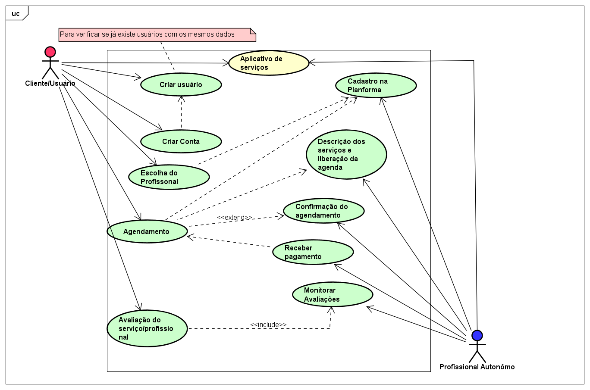
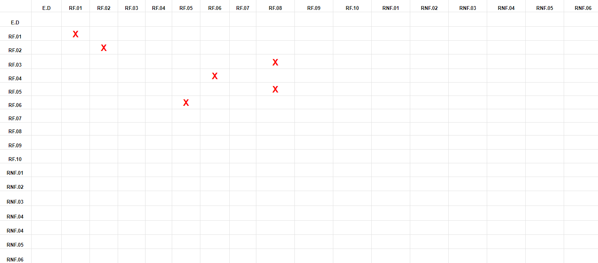

# Especificações do Projeto

## Personas

Maria Alves - 27 anos.

- Profissional Autônoma de Design Gráfico.
- Maria é uma designer gráfica talentosa, mas ainda está construindo sua carreira como autônoma. Com isso usa a plataforma `Ajuda Aí!` para expandir sua base de clientes e mostrar seu portfólio incrível.

Pedro Carvalho - 35 anos.

- Cliente em Busca de Reparos Domésticos.
- Pedro é um pai de família ocupado que recentemente comprou sua primeira casa. Ele precisa de um eletricista confiável para resolver um problema de fiação. Usando `Ajuda Aí!`, Pedro pode navegar pela categoria de serviços domésticos e encontrar eletricistas qualificados em sua área.

Carolina Costa - 24 anos.

- Empreendedora Iniciante.
- Carolina está lançando uma startup de moda sustentável e precisa de um fotógrafo para tirar fotos de seus produtos. Como ela está no início, o orçamento é apertado. Carolina encontra a solução perfeita em `Ajuda aí!`, onde fotógrafos autônomos oferecem pacotes acessíveis.

Rafael Ferreira - 40 anos.

- Viajante Precisando de Serviços Temporários.
- Em sua última parada, ele percebeu que seu laptop precisava de reparos urgentes. Usando `Ajuda Aí!`, Rafael encontra técnicos de informática disponíveis em sua localização atual.

## Histórias de Usuários

Com base na análise das personas foram identificadas as seguintes histórias de usuários:

| `PERSONA`       | `FUNCIONALIDADE`                                                               | `MOTIVO/VALOR`                                                                                        |
| --------------- | ------------------------------------------------------------------------------ | ----------------------------------------------------------------------------------------------------- |
| Maria Alves     | Precisar um local de para divulgar seu trabalho de forma eficaz                | Ter um lugar que serve como vitrine para todo seu talento.                                            |
| Pedro Carvalho  | Cuidar bem da sua casa conseguindo contato com pessoas de serviço de qualidade | Ter acesso à profissionais que oferecem soluções rápidas e eficientes para necessidades do dia a dia. |
| Carolina Costa  | Ter a chance e acessibilidade de começar seus projetos                         | Ter acesso à profissionais sem gastar muito                                                           |
| Rafael Ferreira | Contratar profissionais de forma bem pratica e sem limitações                  | Ter acesso a profissionias durante as suas viagens                                                    |

## Modelagem do Processo de Negócio

### Análise da Situação Atual

O setor enfrenta desafios significativos relacionados à busca eficiente de clientes por parte dos autônomos. Esses problemas incluem:

Falta de visibilidade: Muitos autônomos não têm uma plataforma centralizada para se apresentar aos potenciais clientes, o que resulta em uma falta de visibilidade e dificuldade em se destacar no mercado.

Desperdício de tempo: Autônomos frequentemente gastam tempo precioso procurando ativamente clientes, seja por meio de anúncios locais, redes sociais ou outros métodos, o que pode ser ineficiente e cansativo.

Falta de confiabilidade: Os clientes também podem enfrentar dificuldades em encontrar autônomos confiáveis e qualificados para os serviços que necessitam, uma vez que não há uma fonte centralizada de informações sobre esses profissionais.

Comunicação ineficaz: A comunicação entre autônomos e clientes muitas vezes ocorre de maneira ineficiente, tornando difícil a coordenação de horários e detalhes dos serviços a serem prestados.

Acesso limitado à tecnologia: Alguns autônomos podem não estar familiarizados com ferramentas tecnológicas que poderiam ajudá-los a encontrar clientes de forma mais eficaz.

### Descrição Geral da Proposta

Uma solução para os desafios enfrentados pelos autônomos é a criação de uma plataforma digital de correspondência entre autônomos e clientes.

Essa iniciativa visa melhorar significativamente a experiência de ambas as partes envolvidas, contribuindo para o desenvolvimento econômico e aprimorando a eficiência do mercado de trabalho autônomo.

A plataforma digital proposta funcionaria como um intermediário eficiente, reunindo autônomos de diferentes áreas, como serviços de reparo, construção, consultoria, transporte, design, entre outros, e os clientes que necessitam desses serviços. Os principais componentes e benefícios da proposta incluem:

Conexão Eficiente: A plataforma oferecerá uma interface fácil de usar, onde autônomos podem se cadastrar e criar perfis detalhados com suas habilidades, experiência e disponibilidade. Os clientes, por sua vez, podem procurar profissionais com base em suas necessidades específicas, como localização, tipo de serviço e orçamento.

Transparência e Confiança: A plataforma promoverá a transparência ao exibir avaliações e comentários de clientes anteriores sobre os serviços prestados pelos autônomos. Isso ajuda os clientes a tomar decisões informadas e permite que os autônomos construam uma reputação sólida.

Desenvolvimento da Comunidade: A proposta não apenas beneficia os autônomos e os clientes, mas também contribui para o crescimento econômico da região, incentivando a contratação local e fortalecendo a economia local.

Impacto Social Positivo: Ao criar uma rede mais eficiente e confiável de autônomos e clientes, a plataforma pode contribuir para a redução do desemprego e subemprego na região, bem como aumentar a qualidade dos serviços disponíveis para a comunidade.

### Processo 1 – Fluxo da aplicação

## Indicadores de Desempenho

Usar o seguinte modelo:

Esses indicadores de desempenho fornecerão insights valiosos sobre a eficácia da plataforma e ajudarão a identificar áreas que precisam de ajustes ou melhorias ao longo do tempo.

É importante monitorar esses KPIs continuamente para garantir que o projeto atenda às expectativas e objetivos estabelecidos.

## Requisitos

### Requisitos Funcionais

| ID     | Descrição do Requisito                                                             | Prioridade |
| ------ | ---------------------------------------------------------------------------------- | ---------- |
| RF-001 | CRUD de autônomos                                                                  | ALTA       |
| RF-002 | CRUD de usuários                                                                   | ALTA       |
| RF-003 | O sistema deve validar informações de registro, como e-mail ou número de telefone. | ALTA       |
| RF-004 | Disponibilizar filtros de pesquisa serviço                                         | MÉDIA      |
| RF-005 | Disponibilizar filtros de pesquisa oportunidade serviço                            | MÉDIA      |
| RF-006 | Permitir a comunicação entre o cliente e o autônomo                                | MÉDIA      |
| RF-007 | CRUD de comentários nos perfis dos autônomos, pelos usuários                       | ALTA       |
| RF-008 | Sistema de Login com autenticação                                                  | ALTA       |
| RF-009 | Login com sistema de Segurança por cadastro                                        | ALTA       |
| RF-010 | CRUD de pontuação                                                                  | ALTA       |

### Requisitos não Funcionais

| ID      | Descrição do Requisito                                                                  | Prioridade |
| ------- | --------------------------------------------------------------------------------------- | ---------- |
| RNF-001 | A plataforma deve ser responsiva e rápida, com tempos de carregamento de página curtos  | MÉDIA      |
| RNF-002 | A plataforma deve ser escalável e acomodar um alto no número de usuários e dados        | BAIXA      |
| RNF-003 | Deve garantir segurança dos dados,sejam protegidos por medidas de segurança robusta     | MÉDIA      |
| RNF-004 | A plataforma deve ter planos de contingência para lidar com interrupções não planejadas | BAIXA      |
| RNF-005 | O sistema deve ser confiável, com um baixo índice de erros e falhas                     | MÉDIA      |
| RNF-006 | O sistema deve cumprir regulamentações e normas legais relevantes                       | BAIXA      |

## Restrições

O projeto está restrito pelos itens apresentados na tabela a seguir.

| ID  | Restrição                                                     |
| --- | ------------------------------------------------------------- |
| 01  | O projeto deverá ser entregue até o final do semestre letivo. |
| 02  | O aplicativo web deve ser construido em React                 |
| 03  | O aplicativo mobile deve ser construido em React Native       |
| 03  | O backend deve ser feito em Node                              |
| 04  | A equipe não pode subcontratar o desenvolvimento do trabalho. |

## Diagrama de Casos de Uso

# Matriz de Rastreabilidade

| ID do requesito | Descrição do Requisito                                         | Casos de Uso Afetados | Testes Afetados | Componentes de Software Afetados  |
| --------------- | -------------------------------------------------------------- | --------------------- | --------------- | --------------------------------- |
| REQ-001         | O sistema deve permitir o login do usuário                     |                       | RF001           | Módulo Autenticação               |
| REQ-002         | O sistema deve permitir que o usuário crie um perfil           |                       | RF002           | Módulo de Gerenciamento de Perfil |
| REQ-003         | O sistema deve ser compatível com dispositivos móveis          |                       | RF008           | -                                 |
| REQ-004         | O sistema deve fornecer segurança cibernética                  |                       | RF006           | Módulo segurança e ESG            |
| REQ-005         | O sistema deve armazenar dados de usuário em um banco de dados |                       | RF008           | Módulo de Banco de Dados          |
| REQ-006         | O sistema deve ser seguro contra ataques de força bruta        |                       | RF005           | Módulo de Segurança               |

# Gerenciamento de Projeto

Divisão de Papéis
Tech Lead: Marcus Vinicius Marinho Ferreira

Scrum Master: Marcus Vinicius Marinho Ferreira

Product Owner: Amanda Eufrasio Cacholi

Equipe de Desenvolvimento

Amanda Eufrasio Cacholi
Marcus Vinicius Marinho Ferreira
Daniel de Oliveira Marcelino
Luiz Fernando Ribeiro Ferreira
Patrick Douglas dos Santos

Equipe de design:

Amanda Eufrasio Cacholi

## Gerenciamento de Tempo

## Gerenciamento de Equipe

## Gestão de Orçamento

