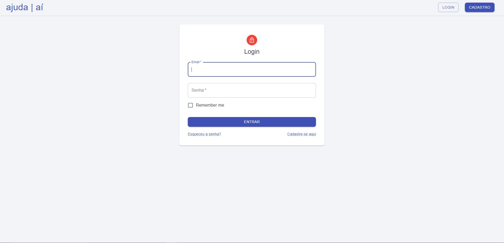

# Projeto de Interface

Pré-requisitos: <a href="2-Especificação do Projeto.md"> Documentação de Especificação</a>

Visão geral da interação do usuário pelas telas do sistema e protótipo interativo das telas com as funcionalidades que fazem parte do sistema (wireframes).

 Apresente as principais interfaces da plataforma. Discuta como ela foi elaborada de forma a atender os requisitos funcionais, não funcionais e histórias de usuário abordados nas <a href="2-Especificação do Projeto.md"> Documentação de Especificação</a>.

## Diagrama de Fluxo

O diagrama apresenta o estudo do fluxo de interação do usuário com o sistema interativo e muitas vezes sem a necessidade do desenho do design das telas da interface. Isso permite que o design das interações seja bem planejado e gere impacto na qualidade no design do wireframe interativo que será desenvolvido logo em seguida.

## Wireframes

São protótipos usados em design de interface para sugerir a estrutura de um site web e seu relacionamentos entre suas páginas. Um wireframe web é uma ilustração semelhante do layout de elementos fundamentais na interface.

### Wireframe Protótipo

A imagem a seguir ilustra o wireframe protótipo da tela inicial da aplicação

#### Tela Inicial:

#### Tela de Login:

Nesta tela, os usuários podem acessar a plataforma com segurança, utilizando suas credenciais. 

#### Tela de Seleção de Usuário Padrão:
Nesta tela de seleção de usuário padrão, os usuários terão a opção de escolher o tipo de perfil que melhor se adapta às suas necessidades. Selecione entre ser um prestador de serviços em busca de oportunidades ou um cliente em busca de um serviço específico.

#### Tela de Cadastro:

Na Tela de Cadastro, oferecemos aos novos usuários a oportunidade de se inscreverem em nossa plataforma. Aqui, eles podem preencher informações essenciais para criar uma conta , para ter uma experiência completa em nossa aplicação.

#### Tela Home:

Aqui, os usuários encontram uma visão geral dos serviços disponíveis, recomendações personalizadas e acesso rápido às funcionalidades principais.

#### Tela de Editar Dados dos Usuários:

Nesta tela, os usuários têm a capacidade de revisar e atualizar suas informações de perfil. Isso inclui a adição ou modificação de detalhes pessoais, preferências e informações profissionais para prestadores de serviços.

