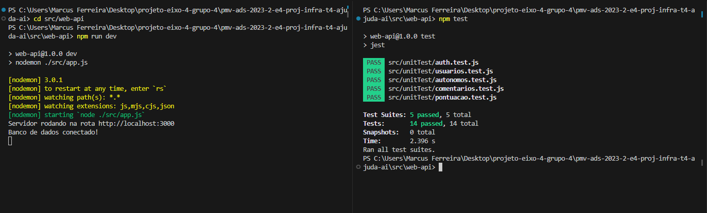

# Plano de Testes de Software

Testes aplicação back-end:

# BACK-END  
Testes aplicação back-end:  
Clique aqui em <a href="../src/web-api"> API - AJUDA AÍ </a> para iniciar a aplicação backend.  
Dentro da documentação, vai conter o comando: 
npm test
 Assim que a aplicação estiver rodando, usando esse comando no mesmo diretorio, porém em outro terminal, irá rodar os testes unitarios na aplicação.

  
# FRONT-END WEB

Em andamento...

# FRONT-END MONILE

Em andamento...
 
## Ferramentas de Testes

Comente sobre as ferramentas de testes utilizadas.
 
Ferramenta de teste para aplicação back-end em *Node.js*: <a href="https://jestjs.io/pt-BR/">JEST</a> e <a href="https://www.npmjs.com/package/supertest">SuperTest</a>
