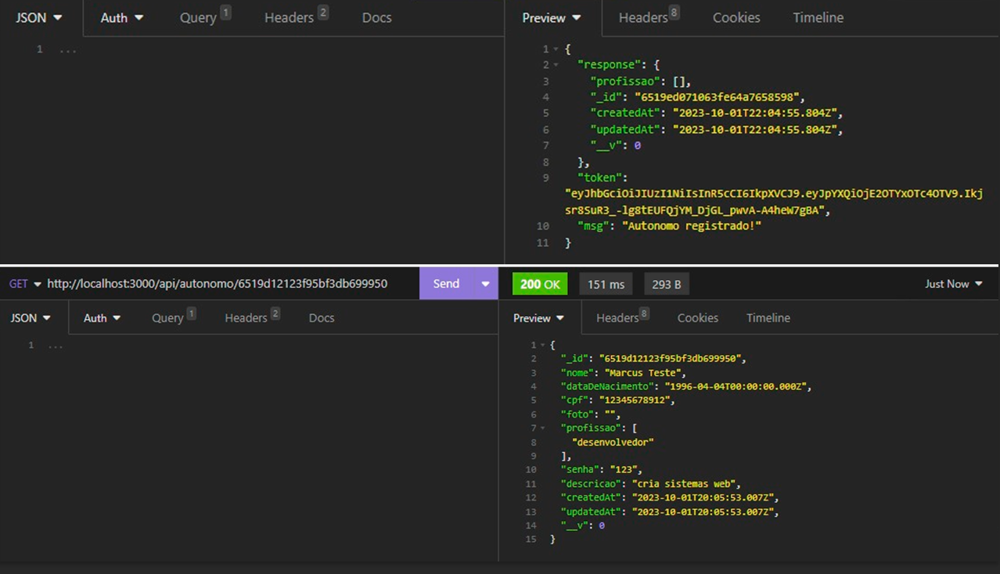
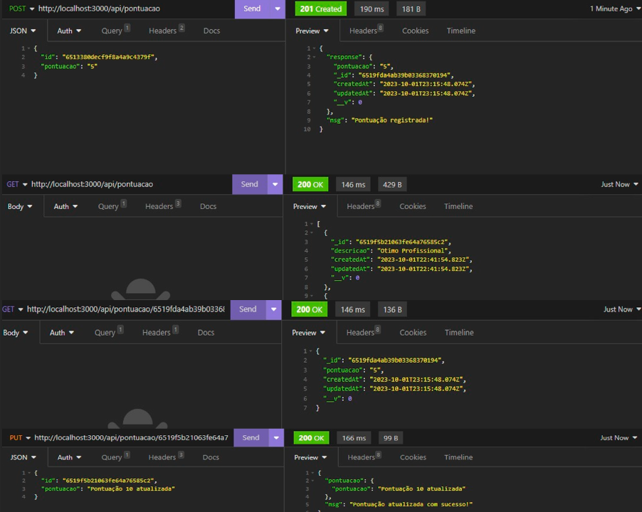
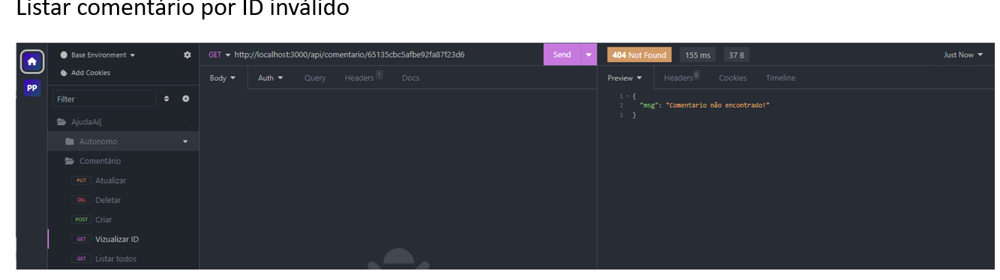
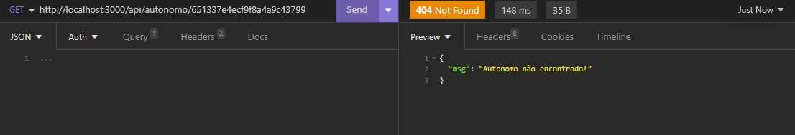
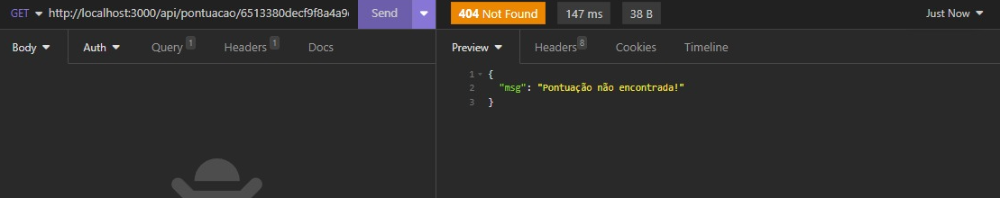

# Registro de Testes de Software

 <b>Resultado do teste de êxito </b>

 As imagens a seguir demonstra o resultado do teste , sendo que o o sistema não retornou nenhum alerta de erro, o que demonstra o sucesso no envio das Informações:

# Testes de Criação de Usuário
###  Teste de Criação e Listagem Por ID

# Teste de Criação de Autonomos

### Listar todos os Autonomos

# Testes de Coméntario
###  Teste de Criação

### Teste de Listagem

### Teste de Listagem Por ID

### Teste de Atualização

### Teste de Atualização

# Teste de Pontuação

 <b>Resultado do teste de erro </b>

##### Teste de Id Invalido

