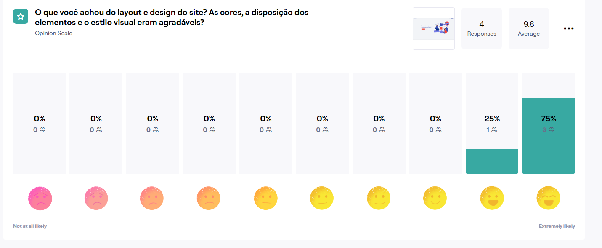

# Registro de Testes de Usabilidade

O Registro de Testes de Usabilidade é um relatório que contém as evidências dos testes e relatos dos usuários participantes, baseado no Plano de Testes de Usabilidade desenvolvido para os casos de uso desta etapa. Quanto maior for a nota, maior a facilidade no uso da aplicação.

Foi utilizada a ferramenta Maze para a verificação da usabilidade das páginas e dos fluxos da aplicação .

 ### - Home
 Página: home -> 

### - Login
 Página: Login -> 

### - Cadastro
 Página: cadastro-> 

 ### - Inicio
 Página: Inicio -> 
